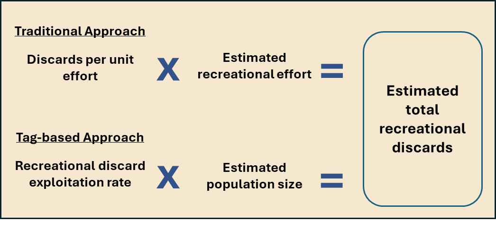

convert plotting into functions and then source the scripts and use functions here 

Plotting functions
```{r, warning=FALSE, echo = FALSE}
source('plot_functions.R')
  setwd('..')
  dir.base = getwd()
  dir.out = paste0(dir.base,'/output')
```


## Figure 1



## Figure 2

```{r,fig.height=3, fig.width=9, echo = FALSE }

#summary plots
par(mfrow=c(1,3), mar = c(5,5,3,3))
#par(mfrow=c(1,1))
plot(selex.bam, type = 'b', lwd = 3, ylab = 'Selectivity', xlab = 'Age', main = 'Selectivity at Age' ,xlim = c(0,20), ylim = c(0,1))
rect(-100, -1000, 2, 1000, col=adjustcolor("orange", 0.1), lty = 0)
rect(2, -1000, 6, 1000, col=adjustcolor("purple", 0.1), lty = 0)
rect(6, -1000, 30, 1000, col=adjustcolor("yellow", 0.1), lty = 0)
abline(v=2, col = 'darkgrey', lty = 2)
abline(v=6, col = 'darkgrey', lty = 2)
fig_label(pos = "topleft", "A", cex=2, col="black")
 
plot(1:12, effort, type = 'b', lwd = 3, xlab = 'Months', ylab = 'Directed reef fish trips', main = 'Effort')
rect(-100, -10e4, 5, 10e5, col=adjustcolor("green", 0.1), lty = 0)
rect(5, -1000, 9, 10e5, col=adjustcolor("red", 0.1), lty = 0)
rect(9, -1000, 20, 10e5, col=adjustcolor("blue", 0.1), lty = 0)
abline(v=5, col = 'darkgrey', lty = 2)
abline(v=9, col = 'darkgrey', lty = 2)
fig_label(pos = "topleft", "B", cex=2, col="black")

plot(1:12, dprop, type = 'b', lwd = 3, xlab = 'Months', ylab = 'Proportion', main = 'Proportion Discarded', ylim = c(0.7, 1))
rect(-100, -10e4, 5, 10e5, col=adjustcolor("green", 0.1), lty = 0)
rect(5, -1000, 9, 10e5, col=adjustcolor("red", 0.1), lty = 0)
rect(9, -1000, 20, 10e5, col=adjustcolor("blue", 0.1), lty = 0)
abline(v=5, col = 'darkgrey', lty = 2)
abline(v=9, col = 'darkgrey', lty = 2)
fig_label(pos = "topleft", "C", cex=2, col="black")
```


## Figure 3

```{r, fig.height = 7, fig.width = 8, echo = FALSE}
#conv plots 
runname = 'update-srfs-tagging-95rep'
results.conv <- extract_columns('update-srfs-tagging-95rep', c("tstep","Nt", 'NtVul',"Ct", "PTit", "PTitVul"))
pop = plot_time_series(results.conv, "Nt", color_by_marks = F) + 
  theme(legend.title = element_blank()) +
  ggtitle("Population Size by Month") +
  xlab("Months") + ylab("Population size (Millions)") + theme_classic()  + 
    theme(strip.text = element_blank()) + 
  theme(plot.title = element_text(hjust = 0.5)) + 
  scale_x_continuous(breaks = seq(0, 12, by = 1)) + 
  scale_y_continuous(
    breaks = c(2.5e6, 2.75e6,3e6,3.25e6,3.5e6,3.75e6),
    labels = c("2.5","2.75", "3","3.25", "3.5","3.75" )
  ) 


prop = plot_time_series(results.conv, "PTit", color_by_marks = T) + 
  theme(legend.title = element_blank()) +
  ggtitle("Population % Tagged by Month") +
  xlab("Months") + ylab("Percent") + theme_classic()  + 
  theme(strip.text = element_blank()) + 
  theme(plot.title = element_text(hjust = 0.5)) + 
  scale_x_continuous(breaks = seq(0, 12, by = 1)) + 
  scale_y_continuous(
    breaks = c(0, 1e-4, 2e-4, 3e-4, 4e-4, 5e-4, 6e-4),
    labels = c("0%","0.01%", "0.02%","0.03%", "0.04%","0.05%", "0.06%" )
  ) 

caphist = read.csv("figure_dat/capture_history_update_95rep.csv")


# Step 1: Create the frequency table and convert to data frame
fate.barplot.dat <- prop.table(table(caphist$fate2, useNA = 'ifany'))
fate.df <- as.data.frame(fate.barplot.dat)
colnames(fate.df) <- c("Fate", "Proportion")

# Step 2: Convert NA in Fate to string for display
fate.df$Fate <- as.character(fate.df$Fate)
fate.df$Fate[is.na(fate.df$Fate)] <- "NA"

# Step 3: Create ggplot
fate = ggplot(fate.df, aes(x = Fate, y = Proportion)) +
  geom_bar(stat = "identity") +
  labs(title = "Known Fates", x = NULL, y = "Proportion") +
  theme_minimal() +
  theme(
    axis.text.x = element_text(angle = 90, vjust = 0.5, hjust = 1),
    plot.margin = margin(t = 15, r = 15, b = 60, l = 15)  # Approximate margins
  ) +
  ylim(0, max(fate.df$Proportion) * 1.1) +
  theme_classic() +
  theme(
    axis.text.x = element_text(angle = 45, hjust = 1),
    plot.margin = margin(t = 15, r = 15, b = 30, l = 15) 
  ) + 
  theme(plot.title = element_text(hjust = 0.5))+ 
  scale_x_discrete(labels = c("dmort" = "Discard mortality", "handmort" = "Tagging mortality", "harvest" = "Harvested", "natmort" = "Natural mortality", "surv.notresighted" = "Survived & not resighted", "surv.resighted" = "Survived & resighted"))


# Step 1: Create proportional table and convert to data frame
reporting.barplot.dat <- prop.table(table(caphist$reporting, useNA = "ifany"))
#alternative 1- a different way of calc
reporting.barplot.dat <- fate.df %>% cbind(report = c(1,0,1,0,0,1)) %>% 
  group_by(report) %>% 
  summarize(Proportion = sum(Proportion, na.rm = TRUE), .groups = "drop") %>% 
  mutate(Proportion = Proportion*ifelse(report == 1, 0.95, 1))# %>%
reporting.barplot.dat = reporting.barplot.dat %>%  tibble::add_row(report = 2, Proportion = (1-sum(reporting.barplot.dat$Proportion))) %>% 
  mutate(report = ifelse(report == 0, 'not_recap', ifelse(report == 1, 'cap_rep',  'cap_notrep')))
#alternative 2 - based on the 53% recap rate currently fed into the model 
reporting.barplot.dat <- prop.table(table(caphist$reporting, useNA = "ifany")) 
reporting.barplot.dat[2] = 0.39 # from barker_dat
reporting.barplot.dat[1] = (0.39 * 1.05 )-0.39
reporting.barplot.dat[3] = 1-(reporting.barplot.dat[2] + reporting.barplot.dat[1] )

reporting.df <- as.data.frame(reporting.barplot.dat)
colnames(reporting.df) <- c("Reporting", "Proportion")

#  Convert NA values to string for display
reporting.df$Reporting <- as.character(reporting.df$Reporting)
reporting.df$Reporting[is.na(reporting.df$Reporting)] <- "NA"

#  Plot
rep = ggplot(reporting.df, aes(x = Reporting, y = Proportion)) +
  geom_bar(stat = "identity") +
  labs(
    title = "Reporting Fates",
    x = NULL,
    y = "Proportion"
  ) +
  theme_minimal() +
  theme(
    axis.text.x = element_text(angle = 0, hjust = 0.5),  # Keep horizontal labels like base R
    plot.margin = margin(t = 15, r = 15, b = 40, l = 15)
  ) +
  ylim(0, max(reporting.df$Proportion) * 1.1)+
  theme_classic() +
  theme(
    axis.text.x = element_text(angle = 45, hjust = 1),
    plot.margin = margin(t = 15, r = 15, b = 30, l = 15) 
  ) + 
  theme(plot.title = element_text(hjust = 0.5))+ 
  scale_x_discrete(labels = c("cap_notrep" = "Captured & not reported", "cap_rep" = "Captured & reported", "not_recap" = "Not recaptured"))

(pop | prop) / (fate | rep) + 
  plot_annotation(tag_levels = 'A')
#ggsave("figures/pop_plots_conv.png", width = 8, height = 7, dpi = 600)

```
Conventional tagging population metrics 

## Figure 4

```{r, fig.height = 7, fig.width = 8, echo = FALSE}

runname = 'update_gene_v3'
p.trips = c(0.02, 0.025, 0.03)

results.gene <- extract_columns('update_gene_v3', c("tstep","Nt", 'NtVul',"Ct", "PTit", "PTitVul"))


pop = plot_time_series(results.gene, "Nt", color_by_marks = F) + 
  theme(legend.title = element_blank()) +
  ggtitle("Population Size by Month") +
  xlab("Months") + ylab("Population size (Millions)") + theme_classic()  + 
  theme(strip.text = element_blank()) + 
  theme(plot.title = element_text(hjust = 0.5)) + 
  scale_x_continuous(breaks = seq(0, 12, by = 1)) + 
  scale_y_continuous(
    breaks = c(2.5e6, 2.75e6,3e6,3.25e6,3.5e6,3.75e6),
    labels = c("2.5","2.75", "3","3.25", "3.5","3.75" )
  ) 

prop = plot_time_series(results.gene, "PTit", color_by_marks = T) + 
  theme(legend.title = element_blank()) +
  ggtitle("Population % Tagged by Month") +
  xlab("Months") + ylab("Percent") + theme_classic()  + 
  theme(strip.text = element_blank()) + 
  theme(plot.title = element_text(hjust = 0.5)) + 
  scale_x_continuous(breaks = seq(0, 12, by = 1)) +
  theme(plot.title = element_text(hjust = 0.5)) + 
  scale_y_continuous(
    breaks = c(0, 25e-4, 50e-4, 75e-4, 100e-4, 125e-4,150e-4),
    labels = c("0%","0.25%", "0.5%","0.75%", "1%", "1.25%", "1.50%" )
  ) +
  scale_colour_discrete(name = "Participation \nrate", labels = c("2%", "2.5%", "3%")) +
  guides(fill = "none", linetype = "none", shape = "none",
         alpha = "none", size = "none")

caphist = read.csv("figure_dat/capture_history_update_ptrip0.03.csv")

# Step 1: Create the frequency table and convert to data frame
fate.barplot.dat <- prop.table(table(caphist$fate2, useNA = 'ifany'))
fate.df <- as.data.frame(fate.barplot.dat)
colnames(fate.df) <- c("Fate", "Proportion")

# Step 2: Convert NA in Fate to string for display
fate.df$Fate <- as.character(fate.df$Fate)
fate.df$Fate[is.na(fate.df$Fate)] <- "NA"

# Step 3: Create ggplot
fate = ggplot(fate.df, aes(x = Fate, y = Proportion)) +
  geom_bar(stat = "identity") +
  labs(title = "Known Fates", x = NULL, y = "Proportion") +
  theme_minimal() +
  theme(
    axis.text.x = element_text(angle = 90, vjust = 0.5, hjust = 1),
    plot.margin = margin(t = 15, r = 15, b = 60, l = 15)  # Approximate margins
  ) +
  ylim(0, max(fate.df$Proportion) * 1.1) +
  theme_classic() +
  theme(
    axis.text.x = element_text(angle = 45, hjust = 1),
    plot.margin = margin(t = 15, r = 15, b = 30, l = 15) 
  ) + 
  theme(plot.title = element_text(hjust = 0.5))+ 
  scale_x_discrete(labels = c("dmort" = "Discard mortality", "handmort" = "Tagging mortality", "harvest" = "Harvested", "natmort" = "Natural mortality", "surv.notresighted" = "Survived & not resighted", "surv.resighted" = "Survived & resighted"))


# Step 1: Create proportional table and convert to data frame
reporting.barplot.dat <- prop.table(table(caphist$reporting, useNA = "ifany"))
reporting.df <- as.data.frame(reporting.barplot.dat)
colnames(reporting.df) <- c("Reporting", "Proportion")

# Step 2: Convert NA values to string for display
reporting.df$Reporting <- as.character(reporting.df$Reporting)
reporting.df$Reporting[is.na(reporting.df$Reporting)] <- "NA"

# Step 3: Plot
rep = ggplot(reporting.df, aes(x = Reporting, y = Proportion)) +
  geom_bar(stat = "identity") +
  labs(
    title = "Reporting Fates",
    x = NULL,
    y = "Proportion"
  ) +
  theme_minimal() +
  theme(
    axis.text.x = element_text(angle = 0, hjust = 0.5),  # Keep horizontal labels like base R
    plot.margin = margin(t = 15, r = 15, b = 40, l = 15)
  ) +
  ylim(0, max(reporting.df$Proportion) * 1.1)+
  theme_classic() +
  theme(
    axis.text.x = element_text(angle = 45, hjust = 1),
    plot.margin = margin(t = 15, r = 15, b = 30, l = 15) 
  ) + 
  theme(plot.title = element_text(hjust = 0.5))+ 
  scale_x_discrete(labels = c("cap_notrep" = "Captured & not reported", "cap_rep" = "Captured & reported", "not_recap" = "Not recaptured"))

(pop | prop) / (fate | rep) + 
  plot_annotation(tag_levels = 'A')
#ggsave("figures/pop_plots_gene.png", width = 8, height = 7, dpi = 600)

```

## Figure 5
```{r}
cv_data = cv_calc(runname = 'update-srfs-tagging-95rep', Nmarks = Nmarks, p.trips = p.trips, tag_type = 'conv')
cv_plot(cv_dat = cv_data, para = 'R', tag_type = 'conv')

```


conventional tagging R parameter CVs

## Figure 6

```{r}
runname = 'update_gene_v3'
p.trips = c(0.02, 0.025, 0.03)
cv_data = cv_calc(runname = 'update_gene_v3', Nmarks = Nmarks, p.trips = p.trips, tag_type = 'gene')
cv_plot(cv_dat = cv_data, para = 'R', tag_type = 'gene')
```

gene tagging R parameter CVs

## Figure 7 

```{r}
est_data = cv_calc(runname = 'update-srfs-tagging-95rep', Nmarks = Nmarks, p.trips = p.trips, tag_type = 'conv')
est_plots(dat_list = dat_list, Nmarks = Nmarks, para = 'R', tag_type = 'conv')
```


conventional tagging R parameter estimates 


