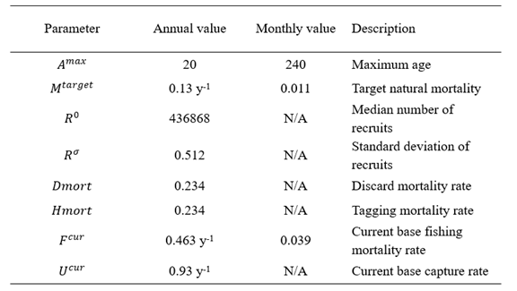
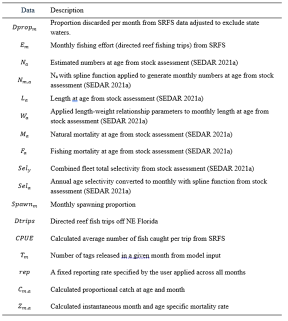
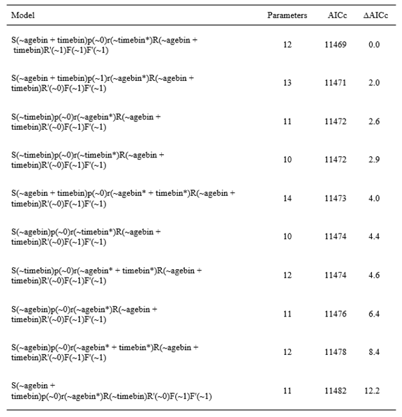
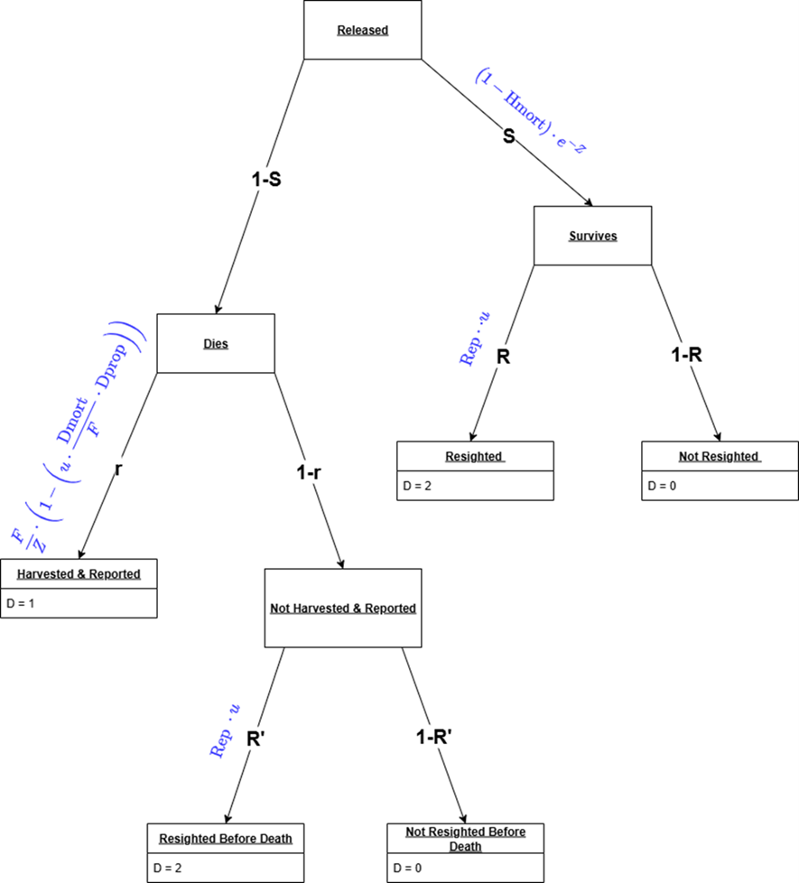

## Table S1

Table S1. Input parameters for the population and fishery dynamics operating model representative of Atlantic red snapper. N/A indicates not applicable.  



## Table S2

Table S2. Operating model input vectors from the Atlantic red snapper stock assessment model (SEDAR 2021a) and the Florida State Reef Fish Survey (SRFS). 



## Table S3

Table S3. Model comparison among red snapper estimation models computed during simulation testing to estimate the CV on discard capture rate for Atlantic red snapper with 3,000 fish tagged and a 95% reporting rate.  If the parameter name is preceded by a value it is fixed at that value.  If it is preceded by timebin it is estimated by time bin and if by agebin it is estimated by age bin. An asterisk indicates there are fixed values within a bin. 



## Figure S1


## Figure S2


## Figure S3
```{r, echo=FALSE, fig.width=8, fig.height=6}
cv_data = cv_calc(runname = 'update-srfs-tagging-50rep', Nmarks = Nmarks, p.trips = p.trips, tag_type = 'conv')
cv_plot(cv_dat = cv_data, para = 'R', tag_type = 'conv') +  ylim(0, 4)
```
Figure S3.  The estimated coefficient of variation (CV) on the catch-and-release probability parameter (R) for the conventional tagging 50% reporting scenario. The gray dashed lines represent the CVs of interest, with the top line representing a CV = 0.3 and the bottom line represents CV = 0.2.


## Figure S4

```{r, echo=FALSE, fig.width=8, fig.height=6}
cv_data = cv_calc(runname = 'update-srfs-tagging-95rep', Nmarks = Nmarks, p.trips = p.trips, tag_type = 'conv')
cv_plot(cv_dat = cv_data, para = 'S', tag_type = 'conv')
```
Figure S4.  Estimated coefficient of variation (CV) on survival probability (S) for Atlantic red snapper estimation model scenarios across different conventional tag numbers and assuming a 95% tag reporting scenario. Grey dashed lines represent CVs of interest, with the top line indicating a CV = 0.3 and the bottom line indicating CV = 0.2.


## Figure S5

```{r, echo=FALSE, fig.width=8, fig.height=6}
cv_data = cv_calc(runname = 'update-srfs-tagging-95rep', Nmarks = Nmarks, p.trips = p.trips, tag_type = 'conv')
cv_plot(cv_dat = cv_data, para = 'r', tag_type = 'conv')
```
Figure S5. Estimated coefficient of variation (CV) on the dead recovery parameter (r) for Atlantic red snapper estimation model scenarios across different conventional tag numbers and assuming a 95% tag reporting rate. Grey dashed lines represent CVs of interest, with the top line indicating CV = 0.3 and the bottom line indicating CV = 0.2.


## Figure S6
```{r, echo=FALSE, fig.width=8, fig.height=6}
est_data = cv_calc(runname = 'update-srfs-tagging-95rep', Nmarks = Nmarks, p.trips = p.trips, tag_type = 'conv')
est_plots(dat_list = dat_list, Nmarks = Nmarks, para = 'S', tag_type = 'conv')
```
Figure S6. Boxplots by time and age bin of estimation model results for Atlantic red snapper monthly survival probability (S) estimated via simulation of conventional tagging under different tag number scenarios and assuming a 95% tag reporting rate. Survival probability is estimated under each tagging scenario and for each age bin for preseason, fishing season, and post season time periods.


## Figure S7
```{r, echo=FALSE, fig.width=8, fig.height=6}
est_data = cv_calc(runname = 'update-srfs-tagging-95rep', Nmarks = Nmarks, p.trips = p.trips, tag_type = 'conv')
est_plots(dat_list = dat_list, Nmarks = Nmarks, para = 'r', tag_type = 'conv')
```
Figure S7. Boxplots of estimation model results for Atlantic red snapper dead recovery probability (r) estimated via simulation of conventional tagging under different tag number scenarios and assuming a 95% reporting rate. Panels are for age bins 2-6 y and 6-25 y, respectively. Excluding the 1-2 y age bin due to the value being fixed at 0. Dead recovery probability is estimated under each tagging scenario and for each age bin for preseason, fishing season, and postseason time periods.

## Figure S8
```{r, echo=FALSE, fig.width=6, fig.height=6}
#generate inputs
u.mat = matrix(rep(selex.m,12), nrow=12, ncol=240, byrow = T)
u.mat = sweep(u.mat, 1, Ut,"*")

u_df <- as.data.frame(u.mat) %>%
  mutate(time_index = row_number()) %>%
  pivot_longer(-time_index, names_to = "age_index", values_to = "val") %>%
  mutate(age_index = as.integer(gsub("V", "", age_index)))

u_df <- u_df %>%
  mutate(
    time_bin = case_when(
      time_index %in% 1:4   ~ "preseason",
      time_index %in% 5:8   ~ "fishing",
      time_index %in% 9:12  ~ "postseason"
    ),
    age_bin = case_when(
      age_index %in% 1:12    ~ "[1,2]",
      age_index %in% 13:60   ~ "(2,6]",
      age_index %in% 61:240  ~ "(6,25]"
    )
  )

input_u <- u_df %>%
  filter(!is.na(time_bin)) %>%   
  group_by(age_bin, time_bin) %>%
  summarise(
    input_mean = mean(val, na.rm = TRUE),
    input_geo_mean = exp(mean(log(val[val > 0]), na.rm = TRUE)),  
    input_dis_u = -log(1-input_geo_mean), 
    .groups = "drop"
  )

#read in ouputs
par_ests = read.csv("../output/3000marks_95rep_ests.csv")

output_pars = par_ests %>% filter(par %in% c("R", "S")) %>%
  select(par, mean, age_bin, time_bin) %>%      
  pivot_wider(names_from = par, values_from = mean) %>% mutate(output_u = S*(R/(0.95))) 

combo = output_pars %>% inner_join(input_u, by = c("age_bin", "time_bin"))

ggplot(combo, aes(x = input_dis_u, y = output_u)) +
  geom_point(size = 2, alpha = 0.7, color = "black") +
  geom_abline(slope = 1, intercept = 0, 
              color = "red", linetype = "dashed", linewidth = 0.6) +
  labs(
    x = "Observed Exploitation Rate",
    y = "Estimated Exploitation Rate"
  ) +
  coord_equal(xlim = c(0,0.125),
              ylim = c(0,0.125)) +  theme_classic(base_size = 14) +  # base font size
  theme(
    axis.title = element_text(size = 16, face = "bold"),
    axis.text  = element_text(size = 14),
    plot.title = element_text(size = 16, face = "bold", hjust = 0.5)
  )
#ggsave("figures/residuals.png", width = 8, height = 7, dpi = 600)
```
Figure S8. Estimated Atlantic red snapper recreational fishery exploitation rate parameters for each time and age bin calculated following the fate diagram equations compared to the input exploitation rate parameters for the same time and age bins. The dashed line has a slope of 1.
